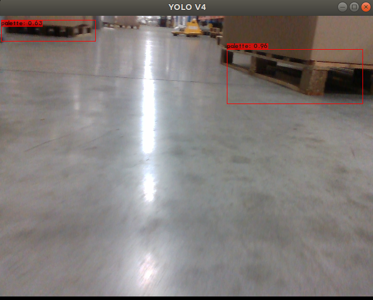

# Detection of Logistics Objects in Context

## Overview

This is a ROS package developed for detecting industrial object. You only look once (YOLO) is a state-of-the-art, real-time object detection system. 

In the following ROS package you are able to use YOLO on GPU and CPU. The pre-trained model of the convolutional neural network is able to detect pre-trained classes including the data set from VOC and COCO, or you can also create a network with your own detection objects. 

For more information about YOLO, Darknet, available training data and training YOLO see the following link: [YOLO: Real-Time Object Detection](http://pjreddie.com/darknet/yolo/).

The YOLO packages have been tested under ROS Melodic and Ubuntu 18.04.

**Author: Mohamed Bouallegue, mohamedboualllegue@gmail.com**

**Appreciation to : [Robotic Systems Lab](http://www.rsl.ethz.ch/), ETH Zurich and [Marko Bjelonic](https://www.markobjelonic.com), marko.bjelonic@mavt.ethz.ch**



Based on the [LOCO Dataset](https://github.com/tum-fml/loco) 2021 dataset, classes:

- forklifts
- pallet trucks 
- pallets 
- small load carriers
- stillages.


### Building

    cd catkin_workspace/src
    git clone --recursive git@gitlab.ubecome.com:vision/darknet_ros_obj_detect.git
    cd ../

    catkin_make -DCMAKE_BUILD_TYPE=Release


### Create Folder
* We need to create a new folder [darknet.zip](/uploads/60c059179d611cf6e4bea611594eefd0/darknet.zip) where the darknet_ros will read these alphabets in which we will copy the same darknet folder and put it in your favorite path for our case it is **"/ubecome/config/detection/darknet"** and make other changes in the "YoloObjectDetector.cpp" in line 17 
```
#ifdef DARKNET_FILE_PATH
std::string homedir = getenv("HOME");
std::string configFilePath_ = "/ubecome/config/detection/darknet";
std::string darknetFilePath_ = homedir+configFilePath_;
```
* ```catkin_make```
* ```catkin_make install```


### Use your own detection objects

In order to use your own detection objects you need to provide your weights and your cfg file inside the directories:

    catkin_workspace/src/darknet_ros/darknet_ros/yolo_network_config/weights/
    catkin_workspace/src/darknet_ros/darknet_ros/yolo_network_config/cfg/

In addition, you need to create your config file for ROS where you define the names of the detection objects. You need to include it inside:

    catkin_workspace/src/darknet_ros/darknet_ros/config/

Then in the launch file you have to point to your new config file in the line:

    <rosparam command="load" ns="darknet_ros" file="$(find darknet_ros)/config/your_config_file.yaml"/>

### Download weights

There are more pre-trained weights from different data sets reported [here](https://pjreddie.com/darknet/yolo/).


## Nodes

### running the node

    roslaunch darknet_ros yolo_v4.launch


### Node: darknet_ros

This is the main YOLO ROS: Real-Time Object Detection for ROS node. It uses the camera measurements to detect pre-learned objects in the frames.

### ROS related parameters

You can change the names and other parameters of the publishers, subscribers and actions inside `darknet_ros/config/ros.yaml`.

#### Subscribed Topics

* **`/camera_reading`** ([sensor_msgs/Image])

    The camera measurements.

#### Published Topics

* **`object_detector`** ([std_msgs::Int8])

    Publishes the number of detected objects.

* **`bounding_boxes`** ([darknet_ros_msgs::BoundingBoxes])

    Publishes an array of bounding boxes that gives information of the position and size of the bounding box in pixel coordinates.

* **`detection_image`** ([sensor_msgs::Image])

    Publishes an image of the detection image including the bounding boxes.

#### Actions

* **`camera_reading`** ([sensor_msgs::Image])

    Sends an action with an image and the result is an array of bounding boxes.

### Detection related parameters

You can change the parameters that are related to the detection by adding a new config file that looks similar to `darknet_ros/config/yolo.yaml`.

* **`image_view/enable_opencv`** (bool)

    Enable or disable the open cv view of the detection image including the bounding boxes.

* **`image_view/wait_key_delay`** (int)

    Wait key delay in ms of the open cv window.

* **`yolo_model/config_file/name`** (string)

    Name of the cfg file of the network that is used for detection. The code searches for this name inside `darknet_ros/yolo_network_config/cfg/`.

* **`yolo_model/weight_file/name`** (string)

    Name of the weights file of the network that is used for detection. The code searches for this name inside `darknet_ros/yolo_network_config/weights/`.

* **`yolo_model/threshold/value`** (float)

    Threshold of the detection algorithm. It is defined between 0 and 1.

* **`yolo_model/detection_classes/names`** (array of strings)

    Detection names of the network used by the cfg and weights file inside `darknet_ros/yolo_network_config/`.
    

